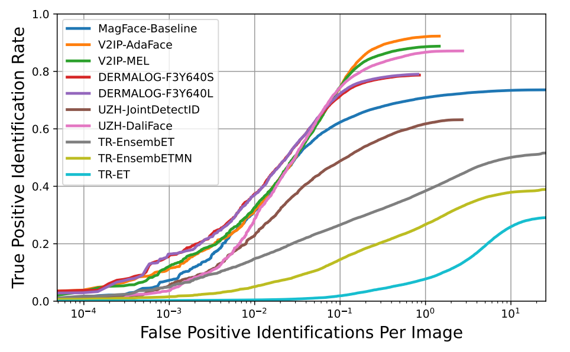

# CyberuSentry
Welcome to CyberuSentry! CyberuSentry is a mixture of 4 words that describe the nature of this project.
  - [Cyber](https://dictionary.cambridge.org/dictionary/english/cyber) - Involving, using, or relating to computers 
  - [Cerberus](https://en.wikipedia.org/wiki/Cerberus) - A three-headed guardian dog from the Greek mythology
  - [Sentry](https://dictionary.cambridge.org/dictionary/english/sentry) - A soldier who guards a place, usually by standing at its entrance
  - [Entry](https://dictionary.cambridge.org/dictionary/english/entry) - The act of entering a place

In this repository you can find the implementation for the CyberuSentry model. CyberuSentry is an ensemble of siamese neural networks
developed for the purpose of participating in the [UCCS Watchlist Challenge](https://www.ifi.uzh.ch/en/aiml/challenge.html). You can find
the summary paper on [this link](https://arxiv.org/abs/2409.07220), and relevant poster [here](watchlist_challenge_Poster.pdf)

The model unfortunately placed last in the challenge. However, such a benchmark conducted by a third-party organization provides valuable
insight into the current state of the model, which is one of the main reasons why I decided to sign up for the challenge. Overall, I am 
satisfied with the result.

You can find the evaluation results in the next section. For detailed description of my approach, see the [PDF report](UCCS_Watchlist_Report.pdf)

# UCCS Watchlist Challenge
The task of this challenge, organized by the [University of Zurich](https://www.uzh.ch/en.html), was to develop a model capable of solving open-set
face identification problem. There was also a part dedicated to face detection, though this part was not considered within this model and pre-trained
face detectors were used to facilitate work in this repository.

The competition started on March 1, 2024. I signed up after I found the competition was ongoing and my application was approved on March 22, 2024.
The deadline for submitting all the necessary files was June 1, 2024.

Since only four teams participated in the challenge, the results are a little scarce. I have no idea what I was up against, whether the other contestants
were individuals like me, or whether some contestants submitted their results on behalf of a commercial or academic institution. More information about
other participants will be published later.

You can find the evaluation curves below. Models from my submissions are highlighted in the red rectangle. For more details, please refer to the
[summary paper](https://arxiv.org/abs/2409.07220)

### Validation results of the submitted models

### Test results of the submitted models

# Models
Since the UCCS Dataset is not public at the moment, the trained models will not be released as every single one of them was trained using licensed data.
Should the dataset become public in the future, I will reconsider publishing the models again.

# Sources
- Images were generated using [Gencraft](https://gencraft.com/) website. All images used were created under a paid subscription.
- [Cambridge Dictionary](https://dictionary.cambridge.org/)
- Sample video from [Pexels](https://www.pexels.com/video/video-of-people-walking-855564/)
- [UCCS Watchlist Challenge](https://www.ifi.uzh.ch/en/aiml/challenge.html)
